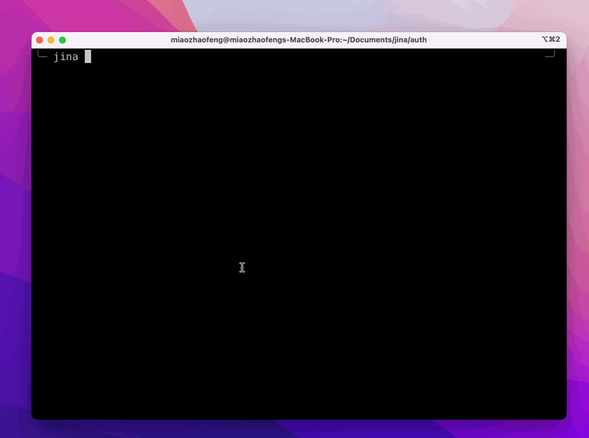

# Jina Auth
Pypi package (jina-auth), provide a CLI to login Jina Eco.

<p align="center">
    <a href="https://codecov.io/gh/jina-ai/hubble-client-python">
        
    </a>
</p>

## Install

```shell
pip install jina-auth
```

## Core functionality

* Authentication and token management.

## Usage

### Login to Jina Cloud

Open browser automatically and login via 3rd party. Token will be saved locally.

```shell
jina auth login
```

### Logout

If there is a valid token locally, this will disable that token and remove it from local config.

```shell
jina auth logout
```

### Personal access token (PAT) management

#### Create a new PAT

```shell
jina auth token <name of PAT> -e <expiration days>
```

#### List PATs

```shell
jina auth token list
```

#### Delete PAT

```shell
jina auth token delete <name of PAT>
```

## Release cycle

- Each time new commits come into `main` branch, CD workflow will generate a new release both on GitHub and Pypi.
- Each time new commits come into `alpha` branch, CD workflow will generate a new pre-release both on GitHub and Pypi.


## Development guide

All of the development scripts are managed by `make`, run `make help` or take a look at `Makefile` to get more detail.

### Generate virtual env

`make env`

### Install pre-commit

`make pre-commit`

### Install dependencies

`make init`

### Lint style

`make style`

### Test

`make test`

<!-- start support-pitch -->
## Support

- Use [Discussions](https://github.com/jina-ai/auth/discussions) to talk about your use cases, questions, and
  support queries.
- Join our [Slack community](https://slack.jina.ai) and chat with other Jina community members about ideas.
- Join our [Engineering All Hands](https://youtube.com/playlist?list=PL3UBBWOUVhFYRUa_gpYYKBqEAkO4sxmne) meet-up to discuss your use case and learn Jina's new features.
    - **When?** The second Tuesday of every month
    - **Where?**
      Zoom ([see our public events calendar](https://calendar.google.com/calendar/embed?src=c_1t5ogfp2d45v8fit981j08mcm4%40group.calendar.google.com&ctz=Europe%2FBerlin)/[.ical](https://calendar.google.com/calendar/ical/c_1t5ogfp2d45v8fit981j08mcm4%40group.calendar.google.com/public/basic.ics))
      and [live stream on YouTube](https://youtube.com/c/jina-ai)
- Subscribe to the latest video tutorials on our [YouTube channel](https://youtube.com/c/jina-ai)

## Join Us

Jina Auth is backed by [Jina AI](https://jina.ai) and licensed under [Apache-2.0](./LICENSE). [We are actively hiring](https://jobs.jina.ai) AI engineers, solution engineers to build the next neural search ecosystem in opensource.

<!-- end support-pitch -->